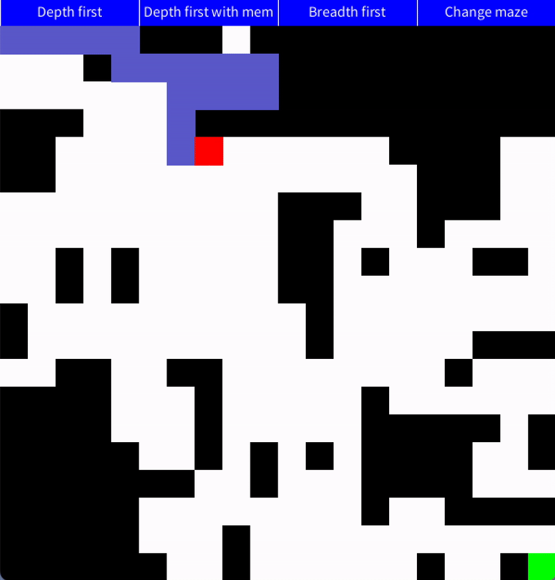

# DFS-BFS-Visualization-with-processing
This project visualizes how Depth-first and Breadth-first search work. In addition, it implements DFS with hashtables to remember dead-ends.

## How to run the project
- Install Python
- Download Processing from [here](https://processing.org/download)
- Install Python mode
- Open the project
- Hit the play button

## The visuals 
- There are four buttons at the top of the window. The first three allow you to change the algorithm that solves the puzzle displayed below them. The last button allows you to rotate between the puzzles you have. 
- For each algorithm selected, the visualizer rotates between two simulations. The first shows the paths explored, and the second shows the algorithm's final path. The first one has a purplish color, while the final path has a green color. 
- The square with a green color is the target we want to reach. The moving red square is where the solver is currently at.

## Future Improvements
- A function that generates new puzzles.
- Make the visuals adjust to dynamic puzzle sizes.
- Add a button to make the simulation go faster or slower.
